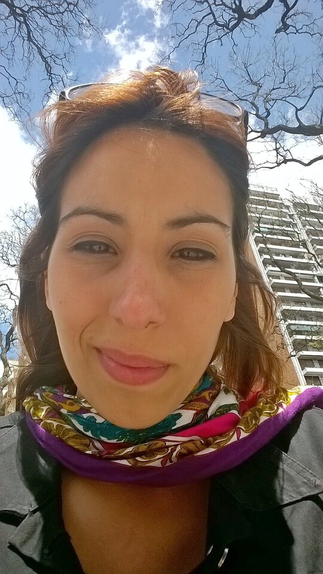

Hola! Estás en el perfil de...
# Julieta Martín :wave:

En este perfil quiero contarte muy brevemente y de manera super informal cuál es el caminito (en el área de estudio y trabajo) que hice, hasta mis actuales 32 casi 33 años, para llegar a ser estudiante de **Informática** de la **UNAHUR**.

* Mi primer "trabajo" fue a los 14 años :baby:. Empecé como **ayudante** de mi profe de Gimnasia Artística , en un club barrial, con el grupo de chicos de 2 a 6 años. Dedicaba algunas horas a la semana durante el año con el entrenamiento regular y en las vacaciones ayudaba con la colonia de verano. En ese momento me pagaban $10 la jornada y me robaba algunos caramelos del frasco de "los premios" :smirk:
De más grande cumplía el mismo rol por cuenta propia, ya que ayudaba a los chicos que cursaban el profesorado de Ed. física y venian a entrenar al club para aprobar la materia de Gimnasia Artística (materia filtro).

* Mi siguiente trabajo fue a los 18 años, ya de manera formal, en un **call center** (sin palabras :expressionless:). Duré 1 año y medio.

* Entre mis 20 y 23 años estudié **Biología** en la UBA :microscope:. Nunca salí del CBC. Me gustó mucho la experiencia pero no era la carrera para mi.

* A mis 23 años decidí realizar el curso de **Bartender**. Trabajé como barwoman en eventos sociales, bares, boliches, etc. Lo único que tengo para decir de ésto es...no es fácil dormir de día.
Trabajaba los fines de semana y durante la semana estudiaba Grafología en un instituto. 
Pude finalizar la carrera a los 3 años de cursada y me recibí como **Técnica Grafóloga** :memo:.

* A los 26 años cambié de rubro, ya buscando nuevamente algo más estable y formal, y empecé a trabajar en una empresa de investigación de mercado como **Analista de datos** :bar_chart: (que en ese momento no tenía ni idea de lo que significaba). Me capacitaron en la empresa y a partir de ese momento descubrí lo mucho que me gustaba y lo buena que era trabajando con la compu. Aprendí a usar **SQL** y a manejar bases de datos. Me encantó trabajar en una multinacional pero la paga era muuuuuuuuuuy baja. Duré casi 2 años.

* A los 28 años comencé un trabajo nuevo en una pyme como **recepcionista**, **comercial**, **asistente técnica** y **limpia culos** (perdón por la expresión :eyes:). La conclusión que saqué de ésta experiencia es que las pymes te exprimen al máximo. Duré casi 3 años.

* A mis 30 decidí darle un cambio rotundo a mi vida y con la ayuda de la Pandemia, que en mi caso resultó ser más positiva que negativa, busqué otras maneras de ganarme la vida que sean más afines a mis gustos y motivaciones. Es así que empecé a trabajar como **Instructora de Spinnning** :bicyclist: en un gimnasio barrial. 
Además, comencé a **pasear perros** :dog: y es al día de hoy que tengo 15 clientes perrunos fijos, que me esperan moviendo la colita y si bien no es un trabajo fácil como muchos piensan, es el más hermoso que tuve. 
En la busqueda de más ingresos, desarrollé un **taller online de Grafología**, que hasta el momento era un conocimiento que no había explotado por diferentes motivos. Trabajé como profesora, tuve muchos alumnos, fue una lindisima experiencia pero no quise continuar. 
Fué un año muy movilizante para mi, de emprendimiento y de romper con prejuicios y miedos (todos ellos imaginarios).

* A los 31 hice un curso en Coderhouse de **Análisis de datos**, para profundizar los conocimientos que ya tenía de mi trabajo anterior, me inscribí en la UNAHUR para comenzar **Informática** :computer: (lo cual estoy muy contenta y la disfruto enormemente) y pienso seguir mi camino a paso lento pero firme, curiosa por saber qué me deparará el destino mañana.

## Muchas gracias por leer! :heart:
 

